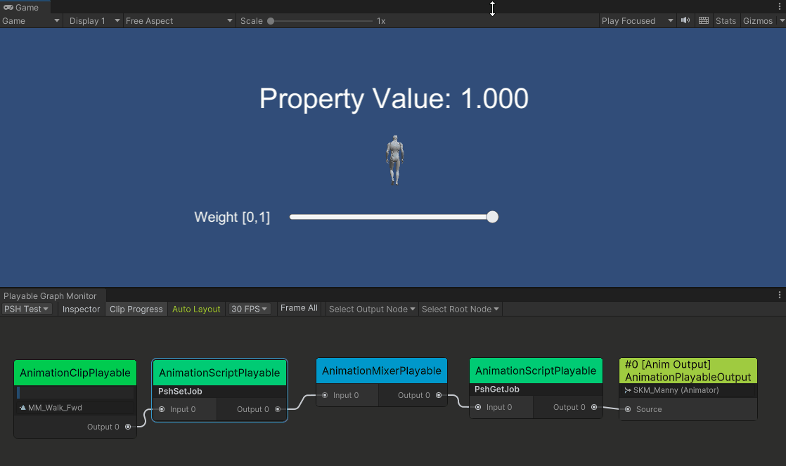
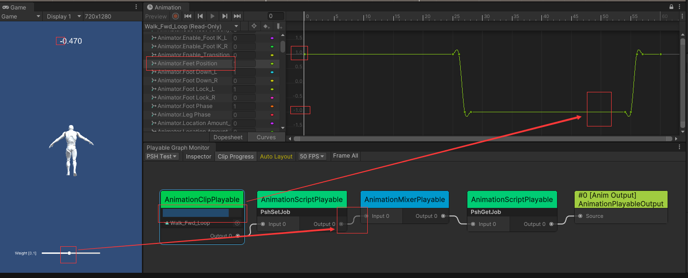
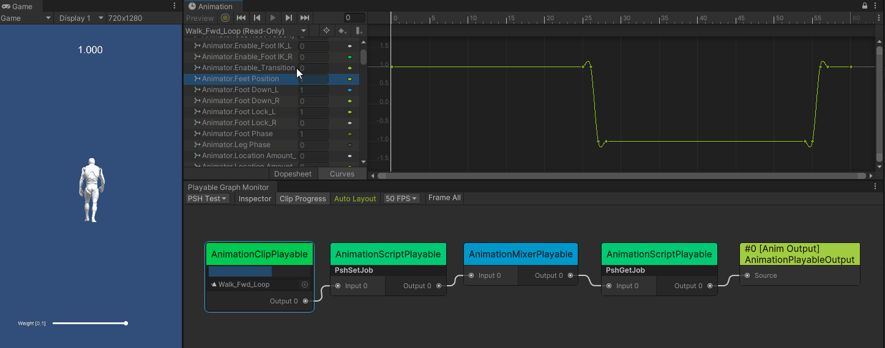
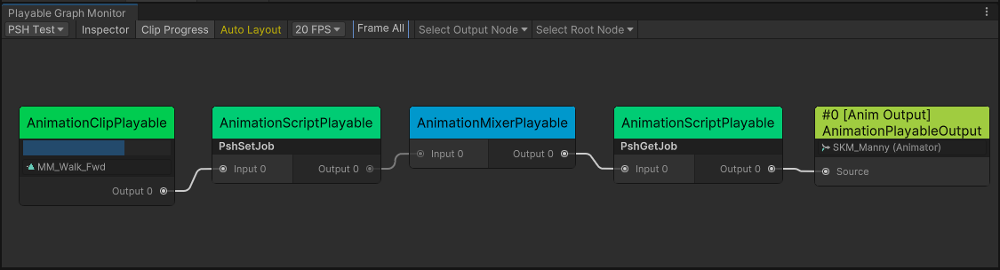

# Unity-Bug-Report-Playable-IN-38805

## About this issue

When the effective weight of `AnimationScriptPlayable` is not `1`, the `PropertyStreamHandle` within it does not take effect.

## How to reproduce

1. Open the "SampleScene".
2. Enter play mode, then you will see "PSH Value: 100.000" in the Game view.
3. Drag the weight slider in the Game view.
4. If the weight is not `1`, the "PSH Value" will become `0.000` instead of `100.000*weight`.

## Further testing 

If an `AnimationClipPlayable` is added as input to `PshSetJob` and the `PropertyStreamHandle` is bound to a custom property in the AnimationClip, then `PropertyStreamHandle.SetFloat` will modify the property value as expected and be affected by the weight. However, when the weight is not `1`, the modified property value is affected by **the sign** of the original property value. 

Open the PlayableGraph Monitor window from "Tools/Bamboo/PlayableGraph Monitor" to inspect the PlayableGraph.

